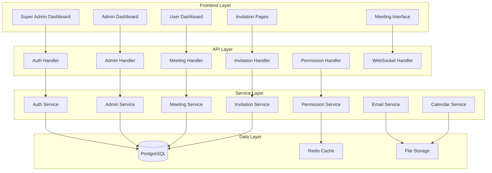

# Design Document

## Overview

This design document outlines the comprehensive transformation of the existing video conference platform into a sophisticated role-based organization management system. The redesign encompasses extensive changes across the entire system architecture, including database schema modifications, API restructuring, frontend component overhaul, and the implementation of advanced meeting controls with a Google Meet-style interface.

### System Transformation Scope

The transformation involves:
- Complete role-based access control implementation
- Extensive database schema modifications and new table additions
- Full API layer restructuring with new handlers and services
- Complete frontend redesign with new dashboard interfaces
- Enhanced WebSocket communication for real-time features
- Advanced permission management system
- Comprehensive admin invitation workflow
- Google Meet-style video conference interface with advanced controls

## Architecture

### System Architecture



### Complete System Architecture Redesign

#### Role-Based Access Control Hierarchy

The system implements a comprehensive three-tier role hierarchy with strict organizational boundaries:

1. **Super Admin**: 
   - Cross-organizational system management
   - Admin invitation and management
   - System-wide analytics and monitoring
   - Organization creation and configuration
   - Cannot create or join meetings

2. **Admin**: 
   - Organization-scoped user and group management
   - Meeting creation and management
   - Permission control and approval
   - Organization analytics and reporting
   - Full meeting participation rights

3. **User**: 
   - Meeting participation only
   - Personal meeting history access
   - Permission request capabilities
   - Profile management within organization

#### Organizational Isolation

Each organization (client) operates as a completely isolated entity:
- Separate user bases with no cross-organization visibility
- Independent meeting spaces and permissions
- Isolated analytics and reporting
- Organization-specific branding and configuration

### Complete Database Schema Redesign

#### Comprehensive Existing Table Modifications

**1. Users Table - Complete Restructure**
```sql
-- Drop existing constraints and indexes
ALTER TABLE users DROP CONSTRAINT IF EXISTS users_email_key;
ALTER TABLE users DROP INDEX IF EXISTS idx_users_email;

-- Add new columns for enhanced functionality
ALTER TABLE users ADD COLUMN client_id INTEGER REFERENCES clients(id);
ALTER TABLE users ADD COLUMN invitation_token VARCHAR(255) UNIQUE;
ALTER TABLE users ADD COLUMN invitation_expires_at TIMESTAMP;
ALTER TABLE users ADD COLUMN is_invited BOOLEAN DEFAULT false;
ALTER TABLE users ADD COLUMN password_created BOOLEAN DEFAULT false;
ALTER TABLE users ADD COLUMN two_factor_enabled BOOLEAN DEFAULT false;
ALTER TABLE users ADD COLUMN two_factor_secret VARCHAR(255);
ALTER TABLE users ADD COLUMN login_attempts INTEGER DEFAULT 0;
ALTER TABLE users ADD COLUMN locked_until TIMESTAMP;
ALTER TABLE users ADD COLUMN password_reset_token VARCHAR(255);
ALTER TABLE users ADD COLUMN password_reset_expires TIMESTAMP;
ALTER TABLE users ADD COLUMN email_verified BOOLEAN DEFAULT false;
ALTER TABLE users ADD COLUMN email_verification_token VARCHAR(255);
ALTER TABLE users ADD COLUMN timezone VARCHAR(100) DEFAULT 'UTC';
ALTER TABLE users ADD COLUMN language VARCHAR(10) DEFAULT 'en';
ALTER TABLE users ADD COLUMN notification_preferences JSONB;
ALTER TABLE users ADD COLUMN last_password_change TIMESTAMP;
ALTER TABLE users ADD COLUMN force_password_change BOOLEAN DEFAULT false;

-- Modify existing columns
ALTER TABLE users MODIFY COLUMN role ENUM('super_admin', 'admin', 'user') NOT NULL;
ALTER TABLE users MODIFY COLUMN status ENUM('active', 'inactive', 'pending', 'suspended', 'locked') DEFAULT 'pending';

-- Add comprehensive constraints
ALTER TABLE users ADD CONSTRAINT check_admin_has_client CHECK (
    (role = 'super_admin') OR (role IN ('admin', 'user') AND client_id IS NOT NULL)
);
ALTER TABLE users ADD CONSTRAINT check_email_format CHECK (email ~* '^[A-Za-z0-9._%+-]+@[A-Za-z0-9.-]+\.[A-Za-z]{2,}$');
ALTER TABLE users ADD CONSTRAINT check_password_length CHECK (LENGTH(password_hash) >= 60);

-- Add new indexes
CREATE INDEX idx_users_client_role ON users(client_id, role);
CREATE INDEX idx_users_invitation_token ON users(invitation_token) WHERE invitation_token IS NOT NULL;
CREATE INDEX idx_users_status_active ON users(status) WHERE status = 'active';
CREATE UNIQUE INDEX idx_users_email_client ON users(email, client_id);
```

**2. Clients Table - Enhanced Organization Management**
```sql
-- Add comprehensive organization features
ALTER TABLE clients ADD COLUMN organization_name VARCHAR(255) NOT NULL;
ALTER TABLE clients ADD COLUMN organization_type ENUM('enterprise', 'business', 'education', 'nonprofit') DEFAULT 'business';
ALTER TABLE clients ADD COLUMN subscription_plan ENUM('free', 'basic', 'premium', 'enterprise') DEFAULT 'free';
ALTER TABLE clients ADD COLUMN subscription_expires_at TIMESTAMP;
ALTER TABLE clients ADD COLUMN max_admins INTEGER DEFAULT 5;
ALTER TABLE clients ADD COLUMN max_users INTEGER DEFAULT 100;
ALTER TABLE clients ADD COLUMN max_concurrent_meetings INTEGER DEFAULT 10;
ALTER TABLE clients ADD COLUMN storage_limit_gb INTEGER DEFAULT 10;
ALTER TABLE clients ADD COLUMN custom_domain VARCHAR(255);
ALTER TABLE clients ADD COLUMN sso_enabled BOOLEAN DEFAULT false;
ALTER TABLE clients ADD COLUMN sso_config JSONB;
ALTER TABLE clients ADD COLUMN branding_config JSONB;
ALTER TABLE clients ADD COLUMN security_settings JSONB;
ALTER TABLE clients ADD COLUMN billing_contact_email VARCHAR(255);
ALTER TABLE clients ADD COLUMN technical_contact_email VARCHAR(255);
ALTER TABLE clients ADD COLUMN timezone VARCHAR(100) DEFAULT 'UTC';
ALTER TABLE clients ADD COLUMN business_hours JSONB;
ALTER TABLE clients ADD COLUMN is_active BOOLEAN DEFAULT true;
ALTER TABLE clients ADD COLUMN trial_ends_at TIMESTAMP;
ALTER TABLE clients ADD COLUMN created_by INTEGER REFERENCES users(id);

-- Add indexes
CREATE INDEX idx_clients_subscription ON clients(subscription_plan, subscription_expires_at);
CREATE INDEX idx_clients_active ON clients(is_active) WHERE is_active = true;
CREATE INDEX idx_clients_domain ON clients(custom_domain) WHERE custom_domain IS NOT NULL;
```

**3. Meetings Table - Complete Meeting Management Overhaul**
```sql
-- Add comprehensive meeting management fields
ALTER TABLE meetings ADD COLUMN meeting_type ENUM('instant', 'scheduled', 'recurring') DEFAULT 'scheduled';
ALTER TABLE meetings ADD COLUMN is_active BOOLEAN DEFAULT false;
ALTER TABLE meetings ADD COLUMN admin_only_controls BOOLEAN DEFAULT true;
ALTER TABLE meetings ADD COLUMN waiting_room_enabled BOOLEAN DEFAULT true;
ALTER TABLE meetings ADD COLUMN auto_admit_users BOOLEAN DEFAULT false;
ALTER TABLE meetings ADD COLUMN lock_meeting BOOLEAN DEFAULT false;
ALTER TABLE meetings ADD COLUMN mute_participants_on_join BOOLEAN DEFAULT true;
ALTER TABLE meetings ADD COLUMN disable_video_on_join BOOLEAN DEFAULT true;
ALTER TABLE meetings ADD COLUMN allow_screen_sharing BOOLEAN DEFAULT false;
ALTER TABLE meetings ADD COLUMN recording_auto_start BOOLEAN DEFAULT false;
ALTER TABLE meetings ADD COLUMN chat_enabled BOOLEAN DEFAULT true;
ALTER TABLE meetings ADD COLUMN raise_hand_enabled BOOLEAN DEFAULT true;
ALTER TABLE meetings ADD COLUMN breakout_rooms_enabled BOOLEAN DEFAULT false;
ALTER TABLE meetings ADD COLUMN max_duration_minutes INTEGER DEFAULT 480;
ALTER TABLE meetings ADD COLUMN meeting_settings JSONB;
ALTER TABLE meetings ADD COLUMN lobby_message TEXT;
ALTER TABLE meetings ADD COLUMN entry_exit_chime BOOLEAN DEFAULT false;
ALTER TABLE meetings ADD COLUMN participant_join_approval BOOLEAN DEFAULT false;
ALTER TABLE meetings ADD COLUMN allow_anonymous_users BOOLEAN DEFAULT false;
ALTER TABLE meetings ADD COLUMN require_meeting_password BOOLEAN DEFAULT false;
ALTER TABLE meetings ADD COLUMN meeting_password_hash VARCHAR(255);
ALTER TABLE meetings ADD COLUMN calendar_event_id VARCHAR(255);
ALTER TABLE meetings ADD COLUMN google_meet_link VARCHAR(500);
ALTER TABLE meetings ADD COLUMN zoom_meeting_id VARCHAR(255);
ALTER TABLE meetings ADD COLUMN teams_meeting_url VARCHAR(500);
ALTER TABLE meetings ADD COLUMN recording_consent_required BOOLEAN DEFAULT true;
ALTER TABLE meetings ADD COLUMN data_retention_days INTEGER DEFAULT 365;
ALTER TABLE meetings ADD COLUMN meeting_notes TEXT;
ALTER TABLE meetings ADD COLUMN meeting_summary JSONB;
ALTER TABLE meetings ADD COLUMN quality_rating INTEGER CHECK (quality_rating >= 1 AND quality_rating <= 5);
ALTER TABLE meetings ADD COLUMN feedback_comments TEXT;
ALTER TABLE meetings ADD COLUMN recurring_pattern JSONB;
ALTER TABLE meetings ADD COLUMN parent_meeting_id INTEGER REFERENCES meetings(id);
ALTER TABLE meetings ADD COLUMN occurrence_date DATE;
ALTER TABLE meetings ADD COLUMN is_cancelled BOOLEAN DEFAULT false;
ALTER TABLE meetings ADD COLUMN cancellation_reason TEXT;
ALTER TABLE meetings ADD COLUMN cancelled_by INTEGER REFERENCES users(id);
ALTER TABLE meetings ADD COLUMN cancelled_at TIMESTAMP;

-- Add comprehensive indexes
CREATE INDEX idx_meetings_type_status ON meetings(meeting_type, status);
CREATE INDEX idx_meetings_client_scheduled ON meetings(client_id, scheduled_start);
CREATE INDEX idx_meetings_active ON meetings(is_active) WHERE is_active = true;
CREATE INDEX idx_meetings_recurring ON meetings(parent_meeting_id, occurrence_date);
CREATE INDEX idx_meetings_calendar_event ON meetings(calendar_event_id) WHERE calendar_event_id IS NOT NULL;
```

**4. Client Features - Granular Permission System**
```sql
-- Add comprehensive permission and feature controls
ALTER TABLE client_features ADD COLUMN admin_approval_required BOOLEAN DEFAULT true;
ALTER TABLE client_features ADD COLUMN default_video_permission BOOLEAN DEFAULT false;
ALTER TABLE client_features ADD COLUMN default_audio_permission BOOLEAN DEFAULT false;
ALTER TABLE client_features ADD COLUMN default_screen_permission BOOLEAN DEFAULT false;
ALTER TABLE client_features ADD COLUMN allow_user_video_request BOOLEAN DEFAULT true;
ALTER TABLE client_features ADD COLUMN allow_user_audio_request BOOLEAN DEFAULT true;
ALTER TABLE client_features ADD COLUMN allow_user_screen_request BOOLEAN DEFAULT true;
ALTER TABLE client_features ADD COLUMN auto_approve_requests BOOLEAN DEFAULT false;
ALTER TABLE client_features ADD COLUMN meeting_lobby_enabled BOOLEAN DEFAULT true;
ALTER TABLE client_features ADD COLUMN participant_limit INTEGER DEFAULT 100;
ALTER TABLE client_features ADD COLUMN meeting_duration_limit INTEGER DEFAULT 480;
ALTER TABLE client_features ADD COLUMN file_sharing_enabled BOOLEAN DEFAULT true;
ALTER TABLE client_features ADD COLUMN file_size_limit_mb INTEGER DEFAULT 100;
ALTER TABLE client_features ADD COLUMN whiteboard_enabled BOOLEAN DEFAULT false;
ALTER TABLE client_features ADD COLUMN polls_enabled BOOLEAN DEFAULT false;
ALTER TABLE client_features ADD COLUMN q_and_a_enabled BOOLEAN DEFAULT false;
ALTER TABLE client_features ADD COLUMN live_streaming_enabled BOOLEAN DEFAULT false;
ALTER TABLE client_features ADD COLUMN meeting_templates_enabled BOOLEAN DEFAULT true;
ALTER TABLE client_features ADD COLUMN custom_backgrounds_enabled BOOLEAN DEFAULT true;
ALTER TABLE client_features ADD COLUMN noise_cancellation_enabled BOOLEAN DEFAULT true;
ALTER TABLE client_features ADD COLUMN transcription_enabled BOOLEAN DEFAULT false;
ALTER TABLE client_features ADD COLUMN translation_enabled BOOLEAN DEFAULT false;
ALTER TABLE client_features ADD COLUMN meeting_insights_enabled BOOLEAN DEFAULT true;
ALTER TABLE client_features ADD COLUMN api_access_enabled BOOLEAN DEFAULT false;
ALTER TABLE client_features ADD COLUMN webhook_notifications_enabled BOOLEAN DEFAULT false;
ALTER TABLE client_features ADD COLUMN sso_required BOOLEAN DEFAULT false;
ALTER TABLE client_features ADD COLUMN ip_restrictions JSONB;
ALTER TABLE client_features ADD COLUMN allowed_domains JSONB;
ALTER TABLE client_features ADD COLUMN blocked_domains JSONB;
```

**5. Groups Table - Enhanced Group Management**
```sql
-- Add comprehensive group features
ALTER TABLE groups ADD COLUMN group_type ENUM('department', 'project', 'custom') DEFAULT 'custom';
ALTER TABLE groups ADD COLUMN is_active BOOLEAN DEFAULT true;
ALTER TABLE groups ADD COLUMN max_members INTEGER DEFAULT 1000;
ALTER TABLE groups ADD COLUMN auto_add_new_users BOOLEAN DEFAULT false;
ALTER TABLE groups ADD COLUMN email_domain_filter VARCHAR(255);
ALTER TABLE groups ADD COLUMN group_settings JSONB;
ALTER TABLE groups ADD COLUMN meeting_defaults JSONB;
ALTER TABLE groups ADD COLUMN notification_settings JSONB;
ALTER TABLE groups ADD COLUMN external_id VARCHAR(255);
ALTER TABLE groups ADD COLUMN sync_source ENUM('manual', 'ldap', 'azure_ad', 'google_workspace') DEFAULT 'manual';
ALTER TABLE groups ADD COLUMN last_sync_at TIMESTAMP;
ALTER TABLE groups ADD COLUMN sync_errors JSONB;

-- Add indexes
CREATE INDEX idx_groups_client_active ON groups(client_id, is_active);
CREATE INDEX idx_groups_type ON groups(group_type);
CREATE INDEX idx_groups_external_id ON groups(external_id) WHERE external_id IS NOT NULL;
```

**6. Chat Messages - Enhanced Chat System**
```sql
-- Add comprehensive chat features
ALTER TABLE chat_messages ADD COLUMN thread_id INTEGER REFERENCES chat_messages(id);
ALTER TABLE chat_messages ADD COLUMN message_status ENUM('sent', 'delivered', 'read', 'deleted') DEFAULT 'sent';
ALTER TABLE chat_messages ADD COLUMN edited_at TIMESTAMP;
ALTER TABLE chat_messages ADD COLUMN edited_by INTEGER REFERENCES users(id);
ALTER TABLE chat_messages ADD COLUMN original_message TEXT;
ALTER TABLE chat_messages ADD COLUMN reactions JSONB;
ALTER TABLE chat_messages ADD COLUMN mentions JSONB;
ALTER TABLE chat_messages ADD COLUMN file_attachments JSONB;
ALTER TABLE chat_messages ADD COLUMN message_priority ENUM('low', 'normal', 'high', 'urgent') DEFAULT 'normal';
ALTER TABLE chat_messages ADD COLUMN is_announcement BOOLEAN DEFAULT false;
ALTER TABLE chat_messages ADD COLUMN expires_at TIMESTAMP;
ALTER TABLE chat_messages ADD COLUMN translation_data JSONB;
ALTER TABLE chat_messages ADD COLUMN sentiment_score DECIMAL(3,2);
ALTER TABLE chat_messages ADD COLUMN flagged_content BOOLEAN DEFAULT false;
ALTER TABLE chat_messages ADD COLUMN flag_reason TEXT;

-- Add indexes
CREATE INDEX idx_chat_thread ON chat_messages(thread_id) WHERE thread_id IS NOT NULL;
CREATE INDEX idx_chat_status ON chat_messages(message_status);
CREATE INDEX idx_chat_meeting_time ON chat_messages(meeting_id, created_at);
```

#### Enhanced Authentication System Design

**1. Multi-Factor Authentication Module**
```go
type MFAService interface {
    GenerateSecret(userID int) (string, error)
    VerifyTOTP(userID int, token string) (bool, error)
    GenerateBackupCodes(userID int) ([]string, error)
    VerifyBackupCode(userID int, code string) (bool, error)
    SendSMSCode(userID int, phoneNumber string) error
    VerifySMSCode(userID int, code string) (bool, error)
    GetMFAStatus(userID int) (*MFAStatus, error)
}

type MFAStatus struct {
    Enabled        bool      `json:"enabled"`
    TOTPEnabled    bool      `json:"totp_enabled"`
    SMSEnabled     bool      `json:"sms_enabled"`
    BackupCodes    int       `json:"backup_codes_remaining"`
    LastUsed       time.Time `json:"last_used"`
}
```

**2. Session Management System**
```go
type SessionService interface {
    CreateSession(userID int, deviceInfo *DeviceInfo) (*Session, error)
    ValidateSession(sessionID string) (*Session, error)
    RefreshSession(sessionID string) (*Session, error)
    RevokeSession(sessionID string) error
    RevokeAllSessions(userID int) error
    GetActiveSessions(userID int) ([]*Session, error)
    CleanupExpiredSessions() error
}

type Session struct {
    ID           string    `json:"id"`
    UserID       int       `json:"user_id"`
    DeviceInfo   JSONB     `json:"device_info"`
    IPAddress    string    `json:"ip_address"`
    UserAgent    string    `json:"user_agent"`
    CreatedAt    time.Time `json:"created_at"`
    LastActivity time.Time `json:"last_activity"`
    ExpiresAt    time.Time `json:"expires_at"`
    IsActive     bool      `json:"is_active"`
}
```

**3. OAuth Integration Module**
```go
type OAuthService interface {
    // Google OAuth
    GetGoogleAuthURL(state string) string
    HandleGoogleCallback(code, state string) (*OAuthUser, error)
    
    // Microsoft OAuth
    GetMicrosoftAuthURL(state string) string
    HandleMicrosoftCallback(code, state string) (*OAuthUser, error)
    
    // Generic OAuth
    LinkOAuthAccount(userID int, provider string, oauthUser *OAuthUser) error
    UnlinkOAuthAccount(userID int, provider string) error
    GetLinkedAccounts(userID int) ([]*LinkedAccount, error)
}

type OAuthUser struct {
    Provider     string `json:"provider"`
    ProviderID   string `json:"provider_id"`
    Email        string `json:"email"`
    Name         string `json:"name"`
    Picture      string `json:"picture"`
    AccessToken  string `json:"access_token"`
    RefreshToken string `json:"refresh_token"`
    ExpiresAt    time.Time `json:"expires_at"`
}
```

#### Google Calendar and Events Integration

**1. Calendar Service Enhancement**
```go
type EnhancedCalendarService interface {
    // Google Calendar Integration
    CreateGoogleCalendarEvent(meeting *Meeting, attendees []string) (*GoogleCalendarEvent, error)
    UpdateGoogleCalendarEvent(eventID string, meeting *Meeting) error
    DeleteGoogleCalendarEvent(eventID string) error
    SyncGoogleCalendar(userID int) error
    
    // Outlook Calendar Integration
    CreateOutlookEvent(meeting *Meeting, attendees []string) (*OutlookEvent, error)
    UpdateOutlookEvent(eventID string, meeting *Meeting) error
    DeleteOutlookEvent(eventID string) error
    
    // Apple Calendar Integration
    GenerateICSFile(meeting *Meeting, attendees []string) ([]byte, error)
    
    // Calendar Sync
    SyncUserCalendars(userID int) error
    GetCalendarAvailability(userID int, start, end time.Time) (*Availability, error)
    FindOptimalMeetingTime(userIDs []int, duration int, preferences *SchedulingPreferences) (*TimeSlot, error)
    
    // Recurring Events
    CreateRecurringEvents(meeting *Meeting, pattern *RecurrencePattern) ([]*Meeting, error)
    UpdateRecurringEvents(parentMeetingID int, changes *MeetingChanges) error
    
    // Notifications and Reminders
    SendMeetingReminders(meetingID int) error
    ScheduleReminderNotifications(meetingID int, reminders []time.Duration) error
}

type GoogleCalendarEvent struct {
    ID          string                 `json:"id"`
    Summary     string                 `json:"summary"`
    Description string                 `json:"description"`
    Start       GoogleDateTime         `json:"start"`
    End         GoogleDateTime         `json:"end"`
    Attendees   []GoogleAttendee       `json:"attendees"`
    Location    string                 `json:"location"`
    HangoutLink string                 `json:"hangoutLink"`
    ConferenceData GoogleConferenceData `json:"conferenceData"`
    Reminders   GoogleReminders        `json:"reminders"`
    Recurrence  []string               `json:"recurrence"`
}

type RecurrencePattern struct {
    Type        string    `json:"type"` // daily, weekly, monthly, yearly
    Interval    int       `json:"interval"`
    DaysOfWeek  []string  `json:"days_of_week"`
    DayOfMonth  int       `json:"day_of_month"`
    WeekOfMonth int       `json:"week_of_month"`
    EndDate     time.Time `json:"end_date"`
    Occurrences int       `json:"occurrences"`
}
```

**2. Email Integration Service**
```go
type EnhancedEmailService interface {
    // Meeting Invitations
    SendMeetingInvitation(meeting *Meeting, attendees []string, template *EmailTemplate) error
    SendMeetingUpdate(meeting *Meeting, attendees []string, changes []string) error
    SendMeetingCancellation(meeting *Meeting, attendees []string, reason string) error
    SendMeetingReminder(meeting *Meeting, attendee string, reminderType string) error
    
    // Admin Invitations
    SendAdminInvitation(invitation *AdminInvitation, template *EmailTemplate) error
    SendInvitationReminder(invitation *AdminInvitation) error
    
    // System Notifications
    SendWelcomeEmail(user *User, organization *Client) error
    SendPasswordResetEmail(user *User, resetToken string) error
    SendSecurityAlert(user *User, alertType string, details map[string]interface{}) error
    
    // Bulk Operations
    SendBulkEmails(emails []*EmailMessage) error
    ScheduleEmail(email *EmailMessage, sendAt time.Time) error
    
    // Templates
    GetEmailTemplate(templateType, clientID int) (*EmailTemplate, error)
    CreateCustomTemplate(template *EmailTemplate) error
    PreviewEmail(templateID int, data map[string]interface{}) (*EmailPreview, error)
}

type EmailTemplate struct {
    ID          int                    `json:"id"`
    ClientID    int                    `json:"client_id"`
    Type        string                 `json:"type"`
    Name        string                 `json:"name"`
    Subject     string                 `json:"subject"`
    HTMLBody    string                 `json:"html_body"`
    TextBody    string                 `json:"text_body"`
    Variables   map[string]interface{} `json:"variables"`
    IsDefault   bool                   `json:"is_default"`
    IsActive    bool                   `json:"is_active"`
    CreatedBy   int                    `json:"created_by"`
    CreatedAt   time.Time              `json:"created_at"`
    UpdatedAt   time.Time              `json:"updated_at"`
}
```

**Users Table - Major Changes**
```sql
-- Complete restructure of users table
ALTER TABLE users DROP COLUMN IF EXISTS organization_id;
ALTER TABLE users ADD COLUMN client_id INTEGER NOT NULL REFERENCES clients(id);
ALTER TABLE users ADD COLUMN invitation_token VARCHAR(255) UNIQUE;
ALTER TABLE users ADD COLUMN invitation_expires_at TIMESTAMP;
ALTER TABLE users ADD COLUMN is_invited BOOLEAN DEFAULT false;
ALTER TABLE users ADD COLUMN password_created BOOLEAN DEFAULT false;
ALTER TABLE users MODIFY COLUMN role ENUM('super_admin', 'admin', 'user') NOT NULL;
ALTER TABLE users ADD CONSTRAINT check_admin_has_client CHECK (
    (role = 'super_admin') OR (role IN ('admin', 'user') AND client_id IS NOT NULL)
);
```

**Meetings Table - Enhanced Structure**
```sql
-- Add comprehensive meeting management fields
ALTER TABLE meetings ADD COLUMN meeting_type ENUM('instant', 'scheduled') DEFAULT 'scheduled';
ALTER TABLE meetings ADD COLUMN is_active BOOLEAN DEFAULT false;
ALTER TABLE meetings ADD COLUMN admin_only_controls BOOLEAN DEFAULT true;
ALTER TABLE meetings ADD COLUMN waiting_room_enabled BOOLEAN DEFAULT true;
ALTER TABLE meetings ADD COLUMN auto_admit_users BOOLEAN DEFAULT false;
ALTER TABLE meetings ADD COLUMN lock_meeting BOOLEAN DEFAULT false;
ALTER TABLE meetings ADD COLUMN mute_participants_on_join BOOLEAN DEFAULT true;
ALTER TABLE meetings ADD COLUMN disable_video_on_join BOOLEAN DEFAULT true;
ALTER TABLE meetings ADD COLUMN allow_screen_sharing BOOLEAN DEFAULT false;
ALTER TABLE meetings ADD COLUMN recording_auto_start BOOLEAN DEFAULT false;
ALTER TABLE meetings ADD COLUMN chat_enabled BOOLEAN DEFAULT true;
ALTER TABLE meetings ADD COLUMN raise_hand_enabled BOOLEAN DEFAULT true;
ALTER TABLE meetings ADD COLUMN breakout_rooms_enabled BOOLEAN DEFAULT false;
ALTER TABLE meetings ADD COLUMN max_duration_minutes INTEGER DEFAULT 480;
ALTER TABLE meetings ADD COLUMN meeting_settings JSONB;
```

**Client Features - Extended Permissions**
```sql
-- Add granular permission controls
ALTER TABLE client_features ADD COLUMN admin_approval_required BOOLEAN DEFAULT true;
ALTER TABLE client_features ADD COLUMN default_video_permission BOOLEAN DEFAULT false;
ALTER TABLE client_features ADD COLUMN default_audio_permission BOOLEAN DEFAULT false;
ALTER TABLE client_features ADD COLUMN default_screen_permission BOOLEAN DEFAULT false;
ALTER TABLE client_features ADD COLUMN allow_user_video_request BOOLEAN DEFAULT true;
ALTER TABLE client_features ADD COLUMN allow_user_audio_request BOOLEAN DEFAULT true;
ALTER TABLE client_features ADD COLUMN allow_user_screen_request BOOLEAN DEFAULT true;
ALTER TABLE client_features ADD COLUMN auto_approve_requests BOOLEAN DEFAULT false;
ALTER TABLE client_features ADD COLUMN meeting_lobby_enabled BOOLEAN DEFAULT true;
ALTER TABLE client_features ADD COLUMN participant_limit INTEGER DEFAULT 100;
```

#### New Tables for Enhanced Functionality

**User Invitations Management**
```sql
CREATE TABLE user_invitations (
    id SERIAL PRIMARY KEY,
    client_id INTEGER NOT NULL REFERENCES clients(id),
    admin_id INTEGER NOT NULL REFERENCES users(id),
    email VARCHAR(255) NOT NULL,
    first_name VARCHAR(100) NOT NULL,
    last_name VARCHAR(100) NOT NULL,
    token VARCHAR(255) UNIQUE NOT NULL,
    expires_at TIMESTAMP NOT NULL,
    status ENUM('pending', 'accepted', 'expired', 'cancelled') DEFAULT 'pending',
    welcome_message TEXT,
    accepted_at TIMESTAMP,
    password_created_at TIMESTAMP,
    reminder_sent_count INTEGER DEFAULT 0,
    last_reminder_sent TIMESTAMP,
    created_at TIMESTAMP DEFAULT CURRENT_TIMESTAMP,
    updated_at TIMESTAMP DEFAULT CURRENT_TIMESTAMP ON UPDATE CURRENT_TIMESTAMP,
    INDEX idx_token (token),
    INDEX idx_email_client (email, client_id),
    INDEX idx_admin_invitations (admin_id),
    UNIQUE KEY unique_email_client (email, client_id)
);
```

**User Analytics and Engagement**
```sql
CREATE TABLE user_analytics (
    id SERIAL PRIMARY KEY,
    user_id INTEGER NOT NULL REFERENCES users(id) ON DELETE CASCADE,
    client_id INTEGER NOT NULL REFERENCES clients(id),
    total_meetings_joined INTEGER DEFAULT 0,
    total_meeting_duration_minutes INTEGER DEFAULT 0,
    total_speaking_time_minutes INTEGER DEFAULT 0,
    total_chat_messages INTEGER DEFAULT 0,
    meetings_this_week INTEGER DEFAULT 0,
    meetings_this_month INTEGER DEFAULT 0,
    average_meeting_duration INTEGER DEFAULT 0,
    most_active_day_of_week INTEGER DEFAULT 1,
    most_active_hour INTEGER DEFAULT 9,
    engagement_score DECIMAL(5,2) DEFAULT 0.0,
    last_meeting_date DATE,
    first_meeting_date DATE,
    preferred_meeting_duration INTEGER DEFAULT 60,
    participation_trends JSONB,
    feature_usage_stats JSONB,
    device_preferences JSONB,
    created_at TIMESTAMP DEFAULT CURRENT_TIMESTAMP,
    updated_at TIMESTAMP DEFAULT CURRENT_TIMESTAMP ON UPDATE CURRENT_TIMESTAMP,
    UNIQUE KEY unique_user_analytics (user_id),
    INDEX idx_client_analytics (client_id),
    INDEX idx_engagement_score (engagement_score)
);
```

**User Preferences and Settings**
```sql
CREATE TABLE user_preferences (
    id SERIAL PRIMARY KEY,
    user_id INTEGER NOT NULL REFERENCES users(id) ON DELETE CASCADE,
    default_audio_enabled BOOLEAN DEFAULT false,
    default_video_enabled BOOLEAN DEFAULT false,
    auto_join_audio BOOLEAN DEFAULT true,
    preferred_camera_device VARCHAR(255),
    preferred_microphone_device VARCHAR(255),
    preferred_speaker_device VARCHAR(255),
    notification_email_enabled BOOLEAN DEFAULT true,
    notification_browser_enabled BOOLEAN DEFAULT true,
    notification_meeting_reminders BOOLEAN DEFAULT true,
    notification_chat_messages BOOLEAN DEFAULT true,
    notification_meeting_invites BOOLEAN DEFAULT true,
    theme_preference ENUM('light', 'dark', 'system') DEFAULT 'system',
    language_preference VARCHAR(10) DEFAULT 'en',
    timezone_preference VARCHAR(100) DEFAULT 'UTC',
    meeting_view_preference ENUM('grid', 'speaker', 'gallery') DEFAULT 'grid',
    chat_position ENUM('right', 'bottom', 'floating') DEFAULT 'right',
    show_participant_names BOOLEAN DEFAULT true,
    show_connection_quality BOOLEAN DEFAULT true,
    auto_hide_controls BOOLEAN DEFAULT false,
    keyboard_shortcuts_enabled BOOLEAN DEFAULT true,
    high_contrast_mode BOOLEAN DEFAULT false,
    reduce_motion BOOLEAN DEFAULT false,
    created_at TIMESTAMP DEFAULT CURRENT_TIMESTAMP,
    updated_at TIMESTAMP DEFAULT CURRENT_TIMESTAMP ON UPDATE CURRENT_TIMESTAMP,
    UNIQUE KEY unique_user_preferences (user_id)
);
```

**User Meeting Bookmarks**
```sql
CREATE TABLE user_meeting_bookmarks (
    id SERIAL PRIMARY KEY,
    user_id INTEGER NOT NULL REFERENCES users(id) ON DELETE CASCADE,
    meeting_id INTEGER NOT NULL REFERENCES meetings(id) ON DELETE CASCADE,
    bookmark_time_seconds INTEGER NOT NULL,
    bookmark_title VARCHAR(255),
    bookmark_description TEXT,
    bookmark_type ENUM('important', 'action_item', 'decision', 'question', 'note') DEFAULT 'note',
    is_private BOOLEAN DEFAULT true,
    created_at TIMESTAMP DEFAULT CURRENT_TIMESTAMP,
    updated_at TIMESTAMP DEFAULT CURRENT_TIMESTAMP ON UPDATE CURRENT_TIMESTAMP,
    INDEX idx_user_bookmarks (user_id),
    INDEX idx_meeting_bookmarks (meeting_id),
    INDEX idx_bookmark_type (bookmark_type)
);
```

**Admin Invitations Management**
```sql
CREATE TABLE admin_invitations (
    id SERIAL PRIMARY KEY,
    client_id INTEGER NOT NULL REFERENCES clients(id),
    email VARCHAR(255) NOT NULL,
    first_name VARCHAR(100) NOT NULL,
    last_name VARCHAR(100) NOT NULL,
    token VARCHAR(255) UNIQUE NOT NULL,
    expires_at TIMESTAMP NOT NULL,
    status ENUM('pending', 'accepted', 'expired', 'cancelled') DEFAULT 'pending',
    invited_by INTEGER NOT NULL REFERENCES users(id),
    accepted_at TIMESTAMP,
    password_created_at TIMESTAMP,
    reminder_sent_count INTEGER DEFAULT 0,
    last_reminder_sent TIMESTAMP,
    created_at TIMESTAMP DEFAULT CURRENT_TIMESTAMP,
    updated_at TIMESTAMP DEFAULT CURRENT_TIMESTAMP ON UPDATE CURRENT_TIMESTAMP,
    INDEX idx_token (token),
    INDEX idx_email_client (email, client_id),
    UNIQUE KEY unique_email_client (email, client_id)
);
```

**Meeting Permissions System**
```sql
CREATE TABLE meeting_permissions (
    id SERIAL PRIMARY KEY,
    meeting_id INTEGER NOT NULL REFERENCES meetings(id) ON DELETE CASCADE,
    user_id INTEGER NOT NULL REFERENCES users(id) ON DELETE CASCADE,
    permission_type ENUM('video', 'audio', 'screen', 'chat', 'recording') NOT NULL,
    is_granted BOOLEAN DEFAULT false,
    requested_at TIMESTAMP,
    approved_at TIMESTAMP,
    denied_at TIMESTAMP,
    approved_by INTEGER REFERENCES users(id),
    denied_by INTEGER REFERENCES users(id),
    request_message TEXT,
    admin_response TEXT,
    auto_granted BOOLEAN DEFAULT false,
    created_at TIMESTAMP DEFAULT CURRENT_TIMESTAMP,
    updated_at TIMESTAMP DEFAULT CURRENT_TIMESTAMP ON UPDATE CURRENT_TIMESTAMP,
    UNIQUE KEY unique_meeting_user_permission (meeting_id, user_id, permission_type),
    INDEX idx_meeting_permissions (meeting_id),
    INDEX idx_user_permissions (user_id),
    INDEX idx_pending_requests (meeting_id, requested_at) WHERE approved_at IS NULL AND denied_at IS NULL
);
```

**Raise Hand Management**
```sql
CREATE TABLE raise_hands (
    id SERIAL PRIMARY KEY,
    meeting_id INTEGER NOT NULL REFERENCES meetings(id) ON DELETE CASCADE,
    user_id INTEGER NOT NULL REFERENCES users(id) ON DELETE CASCADE,
    raised_at TIMESTAMP DEFAULT CURRENT_TIMESTAMP,
    lowered_at TIMESTAMP,
    lowered_by INTEGER REFERENCES users(id),
    auto_lowered BOOLEAN DEFAULT false,
    acknowledged_by INTEGER REFERENCES users(id),
    acknowledged_at TIMESTAMP,
    queue_position INTEGER,
    created_at TIMESTAMP DEFAULT CURRENT_TIMESTAMP,
    INDEX idx_meeting_active_hands (meeting_id, raised_at) WHERE lowered_at IS NULL,
    INDEX idx_user_hands (user_id),
    UNIQUE KEY unique_active_hand (meeting_id, user_id) WHERE lowered_at IS NULL
);
```

**Meeting Analytics and Tracking**
```sql
CREATE TABLE meeting_analytics (
    id SERIAL PRIMARY KEY,
    meeting_id INTEGER NOT NULL REFERENCES meetings(id) ON DELETE CASCADE,
    participant_count INTEGER DEFAULT 0,
    peak_participants INTEGER DEFAULT 0,
    total_duration_seconds INTEGER DEFAULT 0,
    chat_messages_count INTEGER DEFAULT 0,
    screen_shares_count INTEGER DEFAULT 0,
    recordings_count INTEGER DEFAULT 0,
    raise_hands_count INTEGER DEFAULT 0,
    permission_requests_count INTEGER DEFAULT 0,
    average_participant_duration INTEGER DEFAULT 0,
    participant_join_times JSONB,
    participant_leave_times JSONB,
    feature_usage_stats JSONB,
    quality_metrics JSONB,
    created_at TIMESTAMP DEFAULT CURRENT_TIMESTAMP,
    updated_at TIMESTAMP DEFAULT CURRENT_TIMESTAMP ON UPDATE CURRENT_TIMESTAMP,
    INDEX idx_meeting_analytics (meeting_id)
);
```

**Speaking Detection and Activity**
```sql
CREATE TABLE speaking_activity (
    id SERIAL PRIMARY KEY,
    meeting_id INTEGER NOT NULL REFERENCES meetings(id) ON DELETE CASCADE,
    user_id INTEGER NOT NULL REFERENCES users(id) ON DELETE CASCADE,
    started_speaking_at TIMESTAMP DEFAULT CURRENT_TIMESTAMP,
    stopped_speaking_at TIMESTAMP,
    duration_seconds INTEGER,
    audio_level_avg DECIMAL(5,2),
    audio_level_peak DECIMAL(5,2),
    created_at TIMESTAMP DEFAULT CURRENT_TIMESTAMP,
    INDEX idx_meeting_speaking (meeting_id, started_speaking_at),
    INDEX idx_user_speaking (user_id),
    INDEX idx_active_speakers (meeting_id) WHERE stopped_speaking_at IS NULL
);
```

**Meeting Participant Extended Info**
```sql
CREATE TABLE meeting_participant_extended (
    id SERIAL PRIMARY KEY,
    meeting_participant_id INTEGER NOT NULL REFERENCES meeting_participants(id) ON DELETE CASCADE,
    connection_quality ENUM('excellent', 'good', 'fair', 'poor') DEFAULT 'good',
    device_info JSONB,
    browser_info JSONB,
    network_info JSONB,
    permissions_granted JSONB,
    speaking_time_seconds INTEGER DEFAULT 0,
    chat_messages_sent INTEGER DEFAULT 0,
    reactions_sent INTEGER DEFAULT 0,
    screen_share_duration INTEGER DEFAULT 0,
    hand_raises_count INTEGER DEFAULT 0,
    last_activity_at TIMESTAMP DEFAULT CURRENT_TIMESTAMP,
    created_at TIMESTAMP DEFAULT CURRENT_TIMESTAMP,
    updated_at TIMESTAMP DEFAULT CURRENT_TIMESTAMP ON UPDATE CURRENT_TIMESTAMP,
    UNIQUE KEY unique_participant_extended (meeting_participant_id)
);
```

## Frontend Architecture - Complete UI Redesign

### Comprehensive Page Structure and Components
Should use shacn and custom styles using tailwing whereever required. 
#### 1. Super Admin Dashboard (3 Main Pages)

**Page 1: Organization Management Dashboard**
- **Route**: `/super-admin/dashboard`
- **Components**:
  - `SuperAdminHeader` - Navigation with system-wide stats
  - `OrganizationGrid` - Cards showing all organizations with metrics
  - `QuickActions` - Create organization, invite admin buttons
  - `SystemHealthWidget` - Server status, database health
  - `RecentActivityFeed` - System-wide activity log
  - `AnalyticsOverview` - Usage statistics across all organizations

**Page 2: Admin Management**
- **Route**: `/super-admin/admins`
- **Components**:
  - `AdminInvitationForm` - Modal for inviting new admins
  - `AdminListTable` - Sortable table with admin details
  - `InvitationStatusTracker` - Pending/accepted/expired invitations
  - `BulkActionsToolbar` - Bulk invite, resend, cancel operations
  - `AdminDetailsModal` - View/edit admin information
  - `OrganizationSelector` - Filter admins by organization

**Page 3: System Analytics**
- **Route**: `/super-admin/analytics`
- **Components**:
  - `SystemMetricsDashboard` - Charts and graphs
  - `UsageReports` - Meeting usage, user activity
  - `PerformanceMonitor` - System performance metrics
  - `ExportTools` - Data export functionality
  - `DateRangePicker` - Filter analytics by date
  - `MetricFilters` - Filter by organization, admin, etc.

#### 2. Admin Dashboard (4 Main Pages)

**Page 1: Main Dashboard**
- **Route**: `/admin/dashboard`
- **Components**:
  - `AdminHeader` - Organization branding, user profile
  - `MeetingStatsCards` - Today's meetings, upcoming, total users
  - `RecentMeetingsTable` - Last 10 meetings with join counts
  - `UpcomingMeetingsCalendar` - Calendar view of scheduled meetings
  - `UserGroupsOverview` - Quick view of user groups
  - `QuickMeetingCreator` - Instant meeting creation widget
  - `NotificationCenter` - Pending requests, system notifications
  - `ActivityTimeline` - Recent organization activity

**Page 2: Meeting Management**
- **Route**: `/admin/meetings`
- **Sub-components**:
  - `MeetingCreationTabs`:
    - `InstantMeetingForm` - Create immediate meeting
    - `ScheduledMeetingForm` - Schedule future meeting
    - `RecurringMeetingForm` - Set up recurring meetings
  - `MeetingTemplates` - Pre-configured meeting settings
  - `ParticipantSelector` - Choose users/groups to invite
  - `MeetingSettingsPanel` - Configure permissions, features
  - `CalendarIntegration` - Google/Outlook calendar sync
  - `MeetingPreview` - Preview before creation
  - `InvitationPreview` - Preview email invitations

**Page 3: User & Group Management**
- **Route**: `/admin/users`
- **Components**:
  - `UserManagementTabs`:
    - `AllUsersTable` - Sortable, filterable user list
    - `UserGroupsGrid` - Group cards with member counts
    - `BulkUserActions` - Import, export, bulk operations
  - `UserDetailsModal` - Edit user information
  - `GroupCreationModal` - Create/edit user groups
  - `UserInvitationForm` - Invite new users
  - `PermissionMatrix` - User permission overview
  - `UserActivityLog` - Individual user activity

**Page 4: Analytics & Reports**
- **Route**: `/admin/analytics`
- **Components**:
  - `MeetingAnalyticsDashboard` - Meeting usage charts
  - `UserEngagementMetrics` - User participation stats
  - `FeatureUsageReports` - Which features are used most
  - `ExportReportsPanel` - Generate and download reports
  - `CustomReportBuilder` - Create custom analytics
  - `ComplianceReports` - Data retention, security reports

#### 3. User Dashboard (4 Main Pages)

**Page 1: Personal Dashboard**
- **Route**: `/user/dashboard`
- **Components**:
  - `UserHeader` - Profile, notifications, organization branding
  - `WelcomeWidget` - Personalized welcome message with onboarding tips
  - `UpcomingMeetingsWidget` - Next meetings to join with countdown timers
  - `TodaysMeetingsCard` - Today's scheduled meetings with quick join
  - `RecentActivityFeed` - Recent meeting participation and updates
  - `QuickJoinWidget` - Join meeting by ID with validation
  - `PersonalStatsOverview` - Quick stats (meetings this week/month, total participation time)
  - `NotificationCenter` - Meeting invitations, reminders, system notifications

**Page 2: Meeting History & Analytics**
- **Route**: `/user/meetings`
- **Components**:
  - `MeetingHistoryFilter` - Filter by date range, meeting type, participation status
  - `MeetingHistoryTable` - Comprehensive meeting list with duration, participants, role
  - `MeetingDetailsModal` - Detailed meeting information with chat history access
  - `ParticipationAnalytics` - Charts showing meeting participation trends
  - `EngagementMetrics` - Speaking time, chat activity, attendance patterns
  - `MonthlyParticipationChart` - Visual representation of monthly meeting activity
  - `MeetingTypeBreakdown` - Pie chart of meeting types participated in

**Page 3: Recordings & Resources**
- **Route**: `/user/recordings`
- **Components**:
  - `RecordingsList` - Access to permitted meeting recordings with search
  - `RecordingPlayer` - Built-in video player with playback controls
  - `ChatHistoryViewer` - View chat from past meetings with search functionality
  - `DownloadCenter` - Download permitted recordings and chat transcripts
  - `BookmarkedMoments` - Save and access important meeting moments
  - `SharedResources` - Files and documents shared in meetings

**Page 4: Profile & Settings**
- **Route**: `/user/profile`
- **Components**:
  - `ProfileEditor` - Update personal information, profile picture
  - `NotificationPreferences` - Configure email and in-app notifications
  - `MeetingPreferences` - Default audio/video settings, timezone
  - `PrivacySettings` - Control data sharing and visibility preferences
  - `DeviceSettings` - Camera, microphone, and speaker configuration
  - `AccountSecurity` - Password change, two-factor authentication setup
  - `DataExport` - Export personal meeting data and history

#### 4. User Invitation Flow (3 Pages)

**Page 1: User Invitation Landing**
- **Route**: `/user-invitation/:token`
- **Components**:
  - `UserInvitationValidator` - Token validation and organization verification
  - `OrganizationWelcome` - Display inviting admin and organization information
  - `InvitationDetails` - Show invitation details and admin message
  - `UserRegistrationForm` - Create account with password, profile information
  - `TermsAcceptance` - Organization terms and privacy policy acceptance
  - `ErrorDisplay` - Handle expired/invalid tokens with contact information

**Page 2: User Registration Success**
- **Route**: `/user-invitation/success`
- **Components**:
  - `RegistrationSuccessMessage` - Confirmation of account creation
  - `OrganizationOnboarding` - Introduction to organization and meeting platform
  - `DashboardRedirect` - Automatic redirect to user dashboard
  - `GettingStartedGuide` - Quick tips for first-time users

**Page 3: User Invitation Error**
- **Route**: `/user-invitation/error`
- **Components**:
  - `InvitationErrorMessage` - Display specific error details
  - `AdminContactInfo` - Contact information for the inviting admin
  - `SupportOptions` - Help and support contact information
  - `RetryInvitation` - Request new invitation if applicable

#### 4. Enhanced Video Conference Interface (1 Main Page with Multiple Layouts)

**Main Meeting Page**
- **Route**: `/meeting/:meetingId`
- **Core Layout Components**:

**A. Main Video Area (Center)**
- `VideoStageContainer` - Main video display area
  - `PinnedVideoDisplay` - Large video when someone is pinned
  - `ScreenShareDisplay` - Full-screen shared content
  - `DefaultMeetingState` - Default UI when no video/screen
  - `SpeakerSpotlight` - Auto-highlight current speaker

**B. Participant Grid System**
- `ResponsiveVideoGrid` - Adaptive grid layout
  - Grid configurations: 1x1, 2x2, 3x3, 4x4, 6x6
  - Auto-adjusts based on participant count
  - `ParticipantVideoTile` - Individual video tiles
    - Video stream display
    - Mute/unmute indicators
    - Name overlay
    - Speaking indicator (green border)
    - Permission status icons
    - Pin/unpin button
    - Individual controls menu

**C. Left Sidebar Panel (Collapsible)**
- `ParticipantsSidebar` - Vertical participant list
  - `SpeakingIndicator` - Highlight active speakers
  - `RaiseHandQueue` - Show raised hands in order
  - `ParticipantControls` - Admin controls per participant
  - `WaitingRoomList` - Participants waiting for admission
  - `ParticipantSearch` - Search participants by name

**D. Right Sidebar Panel (Collapsible)**
- `MeetingSidebar` - Multi-tab interface
  - `ChatTab` - Enhanced chat interface
    - `MessageList` - Scrollable message history
    - `MessageInput` - Text input with emoji picker
    - `FileUpload` - Image/file sharing
    - `MessageReactions` - React to messages
    - `PrivateMessaging` - DM functionality
  - `ParticipantsTab` - Detailed participant list
  - `SettingsTab` - Meeting settings and controls

**E. Bottom Control Bar (Floating)**
- `MeetingControls` - Main control buttons
  - `AudioToggle` - Mute/unmute microphone
  - `VideoToggle` - Enable/disable camera
  - `ScreenShareButton` - Share screen (with approval)
  - `RaiseHandButton` - Raise/lower hand
  - `ChatToggle` - Show/hide chat
  - `ParticipantsToggle` - Show/hide participants
  - `MoreOptionsMenu` - Additional controls
  - `LeaveMeetingButton` - End participation

**F. Admin-Only Controls (Conditional)**
- `AdminControlPanel` - Additional admin controls
  - `MeetingLockToggle` - Lock/unlock meeting
  - `MuteAllButton` - Mute all participants
  - `AdmitFromWaiting` - Admit waiting participants
  - `PermissionRequests` - Approve/deny permission requests
  - `RecordingControls` - Start/stop recording
  - `MeetingSettings` - Real-time setting changes

**G. Permission Request System**
- `PermissionRequestModal` - User request interface
  - Request video permission
  - Request audio permission
  - Request screen sharing
  - Add message to admin
- `AdminApprovalModal` - Admin approval interface
  - View pending requests
  - Approve/deny with response
  - Bulk approval options

**H. Raise Hand System**
- `RaiseHandIndicator` - Visual hand indicator
- `HandQueueDisplay` - Show queue order
- `AdminHandManagement` - Admin controls for hands

#### 5. Invitation Flow Pages (3 Pages)

**Page 1: Invitation Landing**
- **Route**: `/invitation/:token`
- **Components**:
  - `InvitationValidator` - Token validation
  - `OrganizationBranding` - Show organization info
  - `InvitationDetails` - Show invitation details
  - `PasswordCreationForm` - Create account password
  - `ErrorDisplay` - Handle expired/invalid tokens

**Page 2: Password Creation Success**
- **Route**: `/invitation/success`
- **Components**:
  - `SuccessMessage` - Confirmation of account creation
  - `LoginRedirect` - Redirect to login
  - `OrganizationWelcome` - Welcome message

**Page 3: Invitation Error**
- **Route**: `/invitation/error`
- **Components**:
  - `ErrorMessage` - Display error details
  - `ContactSupport` - Support contact information
  - `RetryOptions` - Options to retry or get help

### State Management Architecture

#### 1. Global State (Redux/Zustand Stores)

**AuthStore**
```javascript
const useAuthStore = create((set, get) => ({
  // State
  user: null,
  accessToken: null,
  refreshToken: null,
  isAuthenticated: false,
  isLoading: false,
  organization: null,
  permissions: [],
  
  // Actions
  login: async (credentials) => { /* login logic */ },
  logout: () => { /* logout logic */ },
  refreshAuth: async () => { /* refresh token logic */ },
  updateProfile: async (data) => { /* update profile */ },
  checkPermission: (permission) => { /* check user permission */ }
}))
```

**MeetingStore**
```javascript
const useMeetingStore = create((set, get) => ({
  // State
  currentMeeting: null,
  participants: [],
  localStream: null,
  remoteStreams: new Map(),
  isConnected: false,
  permissions: {},
  raisedHands: [],
  chatMessages: [],
  speakingUsers: [],
  meetingSettings: {},
  
  // Actions
  joinMeeting: async (meetingId) => { /* join meeting */ },
  leaveMeeting: () => { /* leave meeting */ },
  toggleAudio: () => { /* toggle audio */ },
  toggleVideo: () => { /* toggle video */ },
  requestPermission: (type) => { /* request permission */ },
  raiseHand: () => { /* raise hand */ },
  sendChatMessage: (message) => { /* send chat */ },
  updateParticipants: (participants) => { /* update participants */ }
}))
```

**AdminStore**
```javascript
const useAdminStore = create((set, get) => ({
  // State
  dashboardData: null,
  managedUsers: [],
  userGroups: [],
  meetingHistory: [],
  pendingRequests: [],
  organizationSettings: {},
  
  // Actions
  loadDashboard: async () => { /* load dashboard data */ },
  createMeeting: async (meetingData) => { /* create meeting */ },
  inviteUser: async (userData) => { /* invite user */ },
  approvePermission: async (requestId) => { /* approve permission */ },
  updateSettings: async (settings) => { /* update settings */ }
}))
```

**UIStore**
```javascript
const useUIStore = create((set, get) => ({
  // State
  sidebarOpen: true,
  chatOpen: false,
  participantsOpen: true,
  theme: 'light',
  notifications: [],
  modals: {},
  
  // Actions
  toggleSidebar: () => { /* toggle sidebar */ },
  toggleChat: () => { /* toggle chat */ },
  showNotification: (notification) => { /* show notification */ },
  openModal: (modalType, data) => { /* open modal */ },
  closeModal: (modalType) => { /* close modal */ }
}))
```

#### 2. Component-Level State (React useState/useReducer)

**Meeting Component State**
- Local media stream management
- WebRTC connection states
- UI interaction states
- Form input states
- Modal visibility states

**Dashboard Component State**
- Filter states
- Pagination states
- Sort preferences
- Search queries
- Form validation states

### Component Modifications to Existing VideoConference

#### Additions (New Components)

1. **AdminControlPanel** - New admin-only control interface
2. **PermissionRequestModal** - User permission request interface
3. **AdminApprovalModal** - Admin permission approval interface
4. **RaiseHandIndicator** - Visual hand raise indicator
5. **SpeakingIndicator** - Visual speaking detection
6. **WaitingRoomPanel** - Waiting room management
7. **ParticipantsSidebar** - Left sidebar participant list
8. **EnhancedChatInterface** - Upgraded chat with reactions, files
9. **MeetingSettingsPanel** - Real-time meeting settings
10. **PermissionStatusIndicator** - Show user permission status

#### Modifications (Enhanced Existing Components)

1. **VideoConference** (Main Component)
   - Add admin role detection
   - Add permission checking logic
   - Add waiting room functionality
   - Add speaking detection
   - Add raise hand management

2. **ParticipantGrid** (Enhanced)
   - Add speaking indicators
   - Add permission status icons
   - Add individual participant controls
   - Add pin/unpin functionality per tile

3. **ChatInterface** (Enhanced)
   - Add file upload capability
   - Add message reactions
   - Add private messaging
   - Add message threading
   - Add admin moderation controls

4. **ControlBar** (Enhanced)
   - Add raise hand button
   - Add permission request buttons
   - Add admin-only controls
   - Add meeting settings access

#### Deletions (Removed/Replaced Components)

1. **Simple participant list** - Replaced with enhanced sidebar
2. **Basic chat** - Replaced with enhanced chat interface
3. **Static control bar** - Replaced with dynamic permission-aware controls

### UI Framework and Styling Architecture

#### ShadCN/UI Component Library Integration

**Core ShadCN Components to be Used:**
1. **Layout Components**
   - `Card` - For dashboard widgets, meeting tiles, user cards
   - `Sheet` - For sliding sidebars and mobile panels
   - `Dialog` - For modals (permission requests, settings)
   - `Drawer` - For mobile-friendly bottom sheets
   - `Tabs` - For dashboard sections, meeting settings
   - `Separator` - For visual content separation

2. **Form Components**
   - `Form` - For meeting creation, user management forms
   - `Input` - For text inputs with validation
   - `Textarea` - For meeting descriptions, messages
   - `Select` - For dropdowns (user selection, settings)
   - `Checkbox` - For permission toggles, feature enables
   - `RadioGroup` - For meeting type selection
   - `Switch` - For on/off toggles (audio, video, features)
   - `DatePicker` - For meeting scheduling
   - `TimePicker` - For meeting time selection

3. **Navigation Components**
   - `NavigationMenu` - For main app navigation
   - `Breadcrumb` - For page hierarchy
   - `Pagination` - For data tables and lists
   - `Command` - For search and quick actions

4. **Data Display Components**
   - `Table` - For user lists, meeting history, analytics
   - `Badge` - For status indicators, permission labels
   - `Avatar` - For user profile pictures
   - `Progress` - For loading states, meeting progress
   - `Skeleton` - For loading placeholders
   - `Tooltip` - For help text and additional info

5. **Feedback Components**
   - `Alert` - For system notifications, errors
   - `Toast` - For success messages, real-time updates
   - `AlertDialog` - For confirmation dialogs
   - `HoverCard` - For participant info on hover

#### Custom Tailwind CSS Extensions

**Custom Color Palette**
```css
/* tailwind.config.js extensions */
module.exports = {
  theme: {
    extend: {
      colors: {
        // Meeting interface colors
        'meeting-bg': 'hsl(var(--meeting-bg))',
        'video-tile': 'hsl(var(--video-tile))',
        'speaking-border': 'hsl(var(--speaking-border))',
        'admin-accent': 'hsl(var(--admin-accent))',
        'permission-pending': 'hsl(var(--permission-pending))',
        'permission-granted': 'hsl(var(--permission-granted))',
        'permission-denied': 'hsl(var(--permission-denied))',
        
        // Role-based colors
        'super-admin': 'hsl(var(--super-admin))',
        'admin': 'hsl(var(--admin))',
        'user': 'hsl(var(--user))',
        
        // Status colors
        'online': 'hsl(var(--online))',
        'away': 'hsl(var(--away))',
        'busy': 'hsl(var(--busy))',
        'offline': 'hsl(var(--offline))'
      },
      
      // Custom animations
      animation: {
        'speaking-pulse': 'speaking-pulse 1.5s ease-in-out infinite',
        'hand-wave': 'hand-wave 0.6s ease-in-out infinite',
        'notification-slide': 'notification-slide 0.3s ease-out',
        'video-fade-in': 'video-fade-in 0.5s ease-out',
        'grid-transition': 'grid-transition 0.3s ease-in-out'
      },
      
      // Custom spacing for video grids
      spacing: {
        'video-1x1': '100%',
        'video-2x2': '48%',
        'video-3x3': '31%',
        'video-4x4': '23%',
        'sidebar-width': '320px',
        'control-bar-height': '80px'
      },
      
      // Custom aspect ratios
      aspectRatio: {
        'video': '16 / 9',
        'video-portrait': '9 / 16',
        'meeting-tile': '4 / 3'
      }
    }
  }
}
```

**Custom Component Styles**
```css
/* Custom CSS classes for meeting interface */
@layer components {
  .video-grid-1x1 {
    @apply grid grid-cols-1 gap-4 h-full;
  }
  
  .video-grid-2x2 {
    @apply grid grid-cols-2 gap-4 h-full;
  }
  
  .video-grid-3x3 {
    @apply grid grid-cols-3 gap-3 h-full;
  }
  
  .video-grid-4x4 {
    @apply grid grid-cols-4 gap-2 h-full;
  }
  
  .video-tile {
    @apply relative rounded-lg overflow-hidden bg-video-tile border-2 border-transparent transition-all duration-300;
  }
  
  .video-tile-speaking {
    @apply border-speaking-border shadow-lg animate-speaking-pulse;
  }
  
  .admin-control-panel {
    @apply bg-admin-accent/10 border border-admin-accent/20 rounded-lg p-4;
  }
  
  .permission-badge-pending {
    @apply bg-permission-pending text-permission-pending-foreground;
  }
  
  .permission-badge-granted {
    @apply bg-permission-granted text-permission-granted-foreground;
  }
  
  .permission-badge-denied {
    @apply bg-permission-denied text-permission-denied-foreground;
  }
  
  .floating-controls {
    @apply fixed bottom-6 left-1/2 transform -translate-x-1/2 bg-background/80 backdrop-blur-md border rounded-full px-6 py-3 shadow-lg;
  }
  
  .sidebar-panel {
    @apply w-sidebar-width bg-card border-l border-border h-full overflow-hidden flex flex-col;
  }
  
  .meeting-header {
    @apply bg-card border-b border-border px-4 py-3 flex items-center justify-between;
  }
}

/* Custom animations */
@keyframes speaking-pulse {
  0%, 100% { box-shadow: 0 0 0 0 hsl(var(--speaking-border)); }
  50% { box-shadow: 0 0 0 4px hsl(var(--speaking-border) / 0.3); }
}

@keyframes hand-wave {
  0%, 100% { transform: rotate(0deg); }
  25% { transform: rotate(-10deg); }
  75% { transform: rotate(10deg); }
}

@keyframes notification-slide {
  from { transform: translateX(100%); opacity: 0; }
  to { transform: translateX(0); opacity: 1; }
}

@keyframes video-fade-in {
  from { opacity: 0; transform: scale(0.95); }
  to { opacity: 1; transform: scale(1); }
}

@keyframes grid-transition {
  from { opacity: 0.7; transform: scale(0.98); }
  to { opacity: 1; transform: scale(1); }
}
```

#### Component Styling Specifications

**Dashboard Components**
```jsx
// Example: Admin Dashboard Card using ShadCN + Custom Styles
<Card className="meeting-stats-card hover:shadow-lg transition-shadow duration-300">
  <CardHeader className="pb-3">
    <CardTitle className="text-lg font-semibold flex items-center gap-2">
      <Calendar className="w-5 h-5 text-admin-accent" />
      Today's Meetings
    </CardTitle>
  </CardHeader>
  <CardContent>
    <div className="text-3xl font-bold text-admin-accent">12</div>
    <p className="text-sm text-muted-foreground">+3 from yesterday</p>
  </CardContent>
</Card>
```

**Video Conference Interface**
```jsx
// Example: Video tile with custom styling
<div className={cn(
  "video-tile",
  isSpeaking && "video-tile-speaking",
  isPinned && "ring-2 ring-primary"
)}>
  <video className="w-full h-full object-cover" />
  <div className="absolute bottom-2 left-2 bg-black/60 text-white px-2 py-1 rounded text-xs">
    {participant.name}
  </div>
  {hasRaisedHand && (
    <div className="absolute top-2 right-2 animate-hand-wave">
      <Hand className="w-5 h-5 text-yellow-400" />
    </div>
  )}
</div>
```

**Permission Request Modal**
```jsx
// Example: Permission request using ShadCN Dialog
<Dialog open={showPermissionRequest} onOpenChange={setShowPermissionRequest}>
  <DialogContent className="sm:max-w-md">
    <DialogHeader>
      <DialogTitle>Request Permission</DialogTitle>
      <DialogDescription>
        Ask the meeting admin for permission to use your camera or microphone.
      </DialogDescription>
    </DialogHeader>
    <div className="space-y-4">
      <div className="flex items-center space-x-2">
        <Checkbox id="video" />
        <Label htmlFor="video">Camera</Label>
      </div>
      <div className="flex items-center space-x-2">
        <Checkbox id="audio" />
        <Label htmlFor="audio">Microphone</Label>
      </div>
      <Textarea placeholder="Optional message to admin..." />
    </div>
    <DialogFooter>
      <Button variant="outline" onClick={() => setShowPermissionRequest(false)}>
        Cancel
      </Button>
      <Button onClick={handlePermissionRequest}>
        Send Request
      </Button>
    </DialogFooter>
  </DialogContent>
</Dialog>
```

### Responsive Design Considerations

#### Mobile Layout (< 768px)
- Stack video grid vertically using `flex flex-col`
- Collapsible sidebars become `Sheet` components from ShadCN
- Touch-optimized controls with larger tap targets (`min-h-12`)
- Simplified admin interface using `Drawer` for bottom sheets

#### Tablet Layout (768px - 1024px)
- 2x2 maximum video grid using `video-grid-2x2` class
- Side-by-side chat and participants using `flex-row`
- Condensed control bar with `gap-2` instead of `gap-4`

#### Desktop Layout (> 1024px)
- Full grid layouts up to 4x4 using `video-grid-4x4` class
- Dual sidebars with `sidebar-panel` class
- Expanded admin controls with full `admin-control-panel`
- Picture-in-picture support with custom positioning

### Performance Optimizations

1. **Virtual Scrolling** - Using `@tanstack/react-virtual` for large participant lists
2. **Lazy Loading** - React.lazy() for meeting history and analytics components
3. **Memoization** - React.memo() and useMemo() for expensive calculations
4. **WebRTC Optimization** - Adaptive bitrate, connection management
5. **State Normalization** - Efficient state updates with Zustand
6. **Component Splitting** - Code splitting for different user roles using dynamic imports

## Components and Interfaces

### Complete Backend Architecture Overhaul

#### 1. Complete Service Layer Redesign

**AdminService - New Service**
```go
type AdminService interface {
    // Admin invitation management
    InviteAdmin(ctx context.Context, req *AdminInvitationRequest) (*AdminInvitation, error)
    ValidateInvitationToken(ctx context.Context, token string) (*AdminInvitation, error)
    CompleteAdminRegistration(ctx context.Context, token, password string) (*User, error)
    ResendInvitation(ctx context.Context, invitationID int) error
    CancelInvitation(ctx context.Context, invitationID int) error
    
    // Dashboard data
    GetAdminDashboard(ctx context.Context, adminID int) (*AdminDashboardData, error)
    GetMeetingHistory(ctx context.Context, adminID int, filters *MeetingFilters) ([]*Meeting, error)
    GetUserGroups(ctx context.Context, adminID int) ([]*Group, error)
    GetManagedUsers(ctx context.Context, adminID int) ([]*User, error)
    GetOrganizationAnalytics(ctx context.Context, clientID int) (*OrganizationAnalytics, error)
}
```

**PermissionService - New Service**
```go
type PermissionService interface {
    // Permission requests
    RequestPermission(ctx context.Context, req *PermissionRequest) error
    ApprovePermission(ctx context.Context, permissionID int, adminID int, response string) error
    DenyPermission(ctx context.Context, permissionID int, adminID int, response string) error
    BulkUpdatePermissions(ctx context.Context, meetingID int, permissions map[int]*PermissionUpdate) error
    
    // Permission queries
    GetMeetingPermissions(ctx context.Context, meetingID int) ([]*MeetingPermission, error)
    GetUserPermissions(ctx context.Context, meetingID, userID int) (*MeetingPermission, error)
    GetPendingRequests(ctx context.Context, meetingID int) ([]*MeetingPermission, error)
    
    // Default permissions
    SetDefaultPermissions(ctx context.Context, meetingID int, permissions *DefaultPermissions) error
    GetDefaultPermissions(ctx context.Context, clientID int) (*DefaultPermissions, error)
}
```

**RaiseHandService - New Service**
```go
type RaiseHandService interface {
    RaiseHand(ctx context.Context, meetingID, userID int) error
    LowerHand(ctx context.Context, meetingID, userID int, loweredBy *int) error
    AcknowledgeHand(ctx context.Context, handID, adminID int) error
    GetRaisedHands(ctx context.Context, meetingID int) ([]*RaiseHand, error)
    GetHandQueue(ctx context.Context, meetingID int) ([]*RaiseHand, error)
    ClearAllHands(ctx context.Context, meetingID, adminID int) error
}
```

**Enhanced MeetingService**
```go
type MeetingService interface {
    // Existing methods...
    
    // New meeting types
    CreateInstantMeeting(ctx context.Context, req *InstantMeetingRequest) (*Meeting, error)
    CreateScheduledMeeting(ctx context.Context, req *ScheduledMeetingRequest) (*Meeting, error)
    
    // Meeting control
    StartMeeting(ctx context.Context, meetingID string, hostID int) error
    EndMeeting(ctx context.Context, meetingID string, hostID int) error
    LockMeeting(ctx context.Context, meetingID string, adminID int) error
    UnlockMeeting(ctx context.Context, meetingID string, adminID int) error
    
    // Participant management
    AdmitParticipant(ctx context.Context, meetingID string, userID int, adminID int) error
    RemoveParticipant(ctx context.Context, meetingID string, userID int, adminID int) error
    MuteParticipant(ctx context.Context, meetingID string, userID int, adminID int) error
    UnmuteParticipant(ctx context.Context, meetingID string, userID int, adminID int) error
    
    // Meeting analytics
    GetMeetingAnalytics(ctx context.Context, meetingID int) (*MeetingAnalytics, error)
    UpdateMeetingAnalytics(ctx context.Context, meetingID int, analytics *MeetingAnalytics) error
    
    // Meeting status and time validation
    GetMeetingStatus(ctx context.Context, meetingID string) (*MeetingStatus, error)
    CanJoinMeeting(ctx context.Context, meetingID string, userID int) (bool, string, error)
    ValidateMeetingTime(ctx context.Context, meetingID string) (*TimeValidationResult, error)
    IsWithinJoinWindow(ctx context.Context, meetingID string) (bool, time.Duration, error)
    GetMeetingTimeInfo(ctx context.Context, meetingID string) (*MeetingTimeInfo, error)
}

type TimeValidationResult struct {
    CanJoin           bool      `json:"can_join"`
    Reason            string    `json:"reason"`
    MeetingStatus     string    `json:"meeting_status"` // not_started, active, ended, cancelled
    TimeUntilStart    *int      `json:"time_until_start_minutes"`
    TimeUntilEnd      *int      `json:"time_until_end_minutes"`
    BufferTimeStart   int       `json:"buffer_time_start_minutes"`
    BufferTimeEnd     int       `json:"buffer_time_end_minutes"`
    ActualStartTime   *time.Time `json:"actual_start_time"`
    ScheduledEndTime  time.Time  `json:"scheduled_end_time"`
}

type MeetingTimeInfo struct {
    ScheduledStart    time.Time  `json:"scheduled_start"`
    ScheduledEnd      time.Time  `json:"scheduled_end"`
    ActualStart       *time.Time `json:"actual_start"`
    ActualEnd         *time.Time `json:"actual_end"`
    BufferStart       int        `json:"buffer_start_minutes"`
    BufferEnd         int        `json:"buffer_end_minutes"`
    CurrentTime       time.Time  `json:"current_time"`
    Status            string     `json:"status"`
    CanJoinEarly      bool       `json:"can_join_early"`
    CanJoinLate       bool       `json:"can_join_late"`
}
```

**SpeakingDetectionService - New Service**
```go
type SpeakingDetectionService interface {
    StartSpeaking(ctx context.Context, meetingID, userID int, audioLevel float64) error
    StopSpeaking(ctx context.Context, meetingID, userID int) error
    UpdateAudioLevel(ctx context.Context, meetingID, userID int, audioLevel float64) error
    GetCurrentSpeakers(ctx context.Context, meetingID int) ([]*SpeakingActivity, error)
    GetSpeakingHistory(ctx context.Context, meetingID int) ([]*SpeakingActivity, error)
    GetUserSpeakingStats(ctx context.Context, meetingID, userID int) (*SpeakingStats, error)
}
```

#### 2. Enhanced Models

**AdminInvitationRequest Model**
```go
type AdminInvitationRequest struct {
    ClientID  int    `json:"client_id" validate:"required"`
    Email     string `json:"email" validate:"required,email"`
    FirstName string `json:"first_name" validate:"required"`
    LastName  string `json:"last_name" validate:"required"`
    Message   string `json:"message,omitempty"`
}
```

**AdminDashboardData Model**
```go
type AdminDashboardData struct {
    RecentMeetings      []*Meeting           `json:"recent_meetings"`
    UpcomingMeetings    []*Meeting           `json:"upcoming_meetings"`
    UserGroups          []*Group             `json:"user_groups"`
    ManagedUsers        []*User              `json:"managed_users"`
    MeetingStats        *MeetingStats        `json:"meeting_stats"`
    UserEngagement      *UserEngagement      `json:"user_engagement"`
    SystemHealth        *SystemHealth        `json:"system_health"`
    PendingInvitations  []*AdminInvitation   `json:"pending_invitations"`
}
```

**MeetingStatus Model**
```go
type MeetingStatus struct {
    ID                  int                    `json:"id"`
    MeetingID           string                 `json:"meeting_id"`
    Status              string                 `json:"status"` // waiting, active, ended
    IsLocked            bool                   `json:"is_locked"`
    ParticipantCount    int                    `json:"participant_count"`
    MaxParticipants     int                    `json:"max_participants"`
    WaitingRoomCount    int                    `json:"waiting_room_count"`
    ActiveSpeakers      []*User                `json:"active_speakers"`
    RaisedHands         []*RaiseHand           `json:"raised_hands"`
    PendingRequests     []*MeetingPermission   `json:"pending_requests"`
    MeetingSettings     *MeetingSettings       `json:"meeting_settings"`
    StartTime           *time.Time             `json:"start_time"`
    Duration            int                    `json:"duration_minutes"`
}
```

**PermissionRequest Model**
```go
type PermissionRequest struct {
    MeetingID       int    `json:"meeting_id" validate:"required"`
    UserID          int    `json:"user_id" validate:"required"`
    PermissionType  string `json:"permission_type" validate:"required,oneof=video audio screen chat recording"`
    RequestMessage  string `json:"request_message,omitempty"`
}
```

**InstantMeetingRequest Model**
```go
type InstantMeetingRequest struct {
    Title               string                 `json:"title" validate:"required"`
    Description         string                 `json:"description,omitempty"`
    MaxParticipants     int                    `json:"max_participants,omitempty"`
    Password            string                 `json:"password,omitempty"`
    ParticipantEmails   []string               `json:"participant_emails,omitempty"`
    GroupIDs            []int                  `json:"group_ids,omitempty"`
    MeetingSettings     *MeetingSettings       `json:"meeting_settings,omitempty"`
    SendInvitations     bool                   `json:"send_invitations"`
    AutoStart           bool                   `json:"auto_start"`
}
```

**ScheduledMeetingRequest Model**
```go
type ScheduledMeetingRequest struct {
    Title               string                 `json:"title" validate:"required"`
    Description         string                 `json:"description,omitempty"`
    ScheduledStart      time.Time              `json:"scheduled_start" validate:"required"`
    ScheduledEnd        time.Time              `json:"scheduled_end" validate:"required"`
    MaxParticipants     int                    `json:"max_participants,omitempty"`
    Password            string                 `json:"password,omitempty"`
    ParticipantEmails   []string               `json:"participant_emails,omitempty"`
    GroupIDs            []int                  `json:"group_ids,omitempty"`
    MeetingSettings     *MeetingSettings       `json:"meeting_settings,omitempty"`
    SendInvitations     bool                   `json:"send_invitations"`
    SendCalendarEvents  bool                   `json:"send_calendar_events"`
    ReminderSettings    *ReminderSettings      `json:"reminder_settings,omitempty"`
}
```

**MeetingSettings Model**
```go
type MeetingSettings struct {
    WaitingRoomEnabled      bool `json:"waiting_room_enabled"`
    AutoAdmitUsers          bool `json:"auto_admit_users"`
    MuteParticipantsOnJoin  bool `json:"mute_participants_on_join"`
    DisableVideoOnJoin      bool `json:"disable_video_on_join"`
    AllowScreenSharing      bool `json:"allow_screen_sharing"`
    ChatEnabled             bool `json:"chat_enabled"`
    RaiseHandEnabled        bool `json:"raise_hand_enabled"`
    RecordingAutoStart      bool `json:"recording_auto_start"`
    BreakoutRoomsEnabled    bool `json:"breakout_rooms_enabled"`
    MaxDurationMinutes      int  `json:"max_duration_minutes"`
    RequireAdminApproval    bool `json:"require_admin_approval"`
}
```

#### 3. Enhanced API Handlers

**AdminInvitation Model**
```go
type AdminInvitation struct {
    ID           int       `json:"id" db:"id"`
    ClientID     int       `json:"client_id" db:"client_id"`
    Email        string    `json:"email" db:"email"`
    Token        string    `json:"token" db:"token"`
    ExpiresAt    time.Time `json:"expires_at" db:"expires_at"`
    Status       string    `json:"status" db:"status"` // pending, accepted, expired
    InvitedBy    int       `json:"invited_by" db:"invited_by"`
    AcceptedAt   *time.Time `json:"accepted_at" db:"accepted_at"`
    CreatedAt    time.Time `json:"created_at" db:"created_at"`
}
```

**MeetingPermission Model**
```go
type MeetingPermission struct {
    ID           int       `json:"id" db:"id"`
    MeetingID    int       `json:"meeting_id" db:"meeting_id"`
    UserID       int       `json:"user_id" db:"user_id"`
    CanVideo     bool      `json:"can_video" db:"can_video"`
    CanAudio     bool      `json:"can_audio" db:"can_audio"`
    CanScreen    bool      `json:"can_screen" db:"can_screen"`
    CanChat      bool      `json:"can_chat" db:"can_chat"`
    RequestedAt  *time.Time `json:"requested_at" db:"requested_at"`
    ApprovedAt   *time.Time `json:"approved_at" db:"approved_at"`
    ApprovedBy   *int      `json:"approved_by" db:"approved_by"`
    CreatedAt    time.Time `json:"created_at" db:"created_at"`
    UpdatedAt    time.Time `json:"updated_at" db:"updated_at"`
}
```

**RaiseHand Model**
```go
type RaiseHand struct {
    ID        int       `json:"id" db:"id"`
    MeetingID int       `json:"meeting_id" db:"meeting_id"`
    UserID    int       `json:"user_id" db:"user_id"`
    RaisedAt  time.Time `json:"raised_at" db:"raised_at"`
    LoweredAt *time.Time `json:"lowered_at" db:"lowered_at"`
    LoweredBy *int      `json:"lowered_by" db:"lowered_by"`
}
```

#### 2. API Handlers

**AdminHandler**
- `InviteAdmin(w http.ResponseWriter, r *http.Request)`
- `GetAdminDashboard(w http.ResponseWriter, r *http.Request)`
- `GetMeetingHistory(w http.ResponseWriter, r *http.Request)`
- `GetUserGroups(w http.ResponseWriter, r *http.Request)`
- `GetManagedUsers(w http.ResponseWriter, r *http.Request)`

**InvitationHandler**
- `ValidateInvitationToken(w http.ResponseWriter, r *http.Request)`
- `CreatePassword(w http.ResponseWriter, r *http.Request)`
- `ResendInvitation(w http.ResponseWriter, r *http.Request)`

**PermissionHandler**
- `RequestPermission(w http.ResponseWriter, r *http.Request)`
- `ApprovePermission(w http.ResponseWriter, r *http.Request)`
- `BulkUpdatePermissions(w http.ResponseWriter, r *http.Request)`
- `GetMeetingPermissions(w http.ResponseWriter, r *http.Request)`

**Enhanced MeetingHandler**
- `CreateInstantMeeting(w http.ResponseWriter, r *http.Request)`
- `CreateScheduledMeeting(w http.ResponseWriter, r *http.Request)`
- `GetMeetingStatus(w http.ResponseWriter, r *http.Request)`
- `UpdateMeetingPermissions(w http.ResponseWriter, r *http.Request)`

#### 3. WebSocket Message Types

```go
type WebSocketMessage struct {
    Type    string      `json:"type"`
    Payload interface{} `json:"payload"`
}

// Message types:
// - "permission_request"
// - "permission_granted"
// - "permission_denied"
// - "raise_hand"
// - "lower_hand"
// - "speaking_indicator"
// - "admin_control"
```

### Frontend Components

#### 1. Dashboard Components

**SuperAdminDashboard**
- Organization management
- Admin invitation interface
- System analytics
- Admin user list with status

**AdminDashboard**
- Meeting history with analytics
- User group management
- User management interface
- Quick meeting creation
- Upcoming meetings calendar

**UserDashboard**
- Personal meeting history
- Upcoming meetings
- Profile management
- Meeting join interface

#### 2. Meeting Interface Components

**EnhancedVideoConference**
- Google Meet-style grid layout
- Floating control panel
- Permission request dialogs
- Raise hand indicators
- Speaking detection highlights
- Admin control panel

**ParticipantGrid**
- Responsive grid layout (1x1, 2x2, 3x3, 4x4)
- Auto-adjustment based on participant count
- Speaking indicator highlighting
- Permission status indicators

**AdminControlPanel**
- Permission management controls
- Participant management
- Meeting recording controls
- Screen sharing approval
- Raise hand queue management

**PermissionRequestDialog**
- Request video/audio/screen permissions
- Real-time approval status
- Queue position indicator

#### 3. Invitation Flow Components

**InvitationLanding**
- Token validation
- Organization context display
- Password creation form
- Success/error handling

## Data Models

### Database Schema Updates

#### New Tables

```sql
-- Admin invitations table
CREATE TABLE admin_invitations (
    id SERIAL PRIMARY KEY,
    client_id INTEGER NOT NULL REFERENCES clients(id),
    email VARCHAR(255) NOT NULL,
    token VARCHAR(255) UNIQUE NOT NULL,
    expires_at TIMESTAMP NOT NULL,
    status VARCHAR(50) DEFAULT 'pending',
    invited_by INTEGER NOT NULL REFERENCES users(id),
    accepted_at TIMESTAMP,
    created_at TIMESTAMP DEFAULT CURRENT_TIMESTAMP
);

-- Meeting permissions table
CREATE TABLE meeting_permissions (
    id SERIAL PRIMARY KEY,
    meeting_id INTEGER NOT NULL REFERENCES meetings(id),
    user_id INTEGER NOT NULL REFERENCES users(id),
    can_video BOOLEAN DEFAULT false,
    can_audio BOOLEAN DEFAULT false,
    can_screen BOOLEAN DEFAULT false,
    can_chat BOOLEAN DEFAULT true,
    requested_at TIMESTAMP,
    approved_at TIMESTAMP,
    approved_by INTEGER REFERENCES users(id),
    created_at TIMESTAMP DEFAULT CURRENT_TIMESTAMP,
    updated_at TIMESTAMP DEFAULT CURRENT_TIMESTAMP,
    UNIQUE(meeting_id, user_id)
);

-- Raise hand tracking table
CREATE TABLE raise_hands (
    id SERIAL PRIMARY KEY,
    meeting_id INTEGER NOT NULL REFERENCES meetings(id),
    user_id INTEGER NOT NULL REFERENCES users(id),
    raised_at TIMESTAMP DEFAULT CURRENT_TIMESTAMP,
    lowered_at TIMESTAMP,
    lowered_by INTEGER REFERENCES users(id)
);

-- Meeting analytics table
CREATE TABLE meeting_analytics (
    id SERIAL PRIMARY KEY,
    meeting_id INTEGER NOT NULL REFERENCES meetings(id),
    participant_count INTEGER DEFAULT 0,
    peak_participants INTEGER DEFAULT 0,
    total_duration INTEGER DEFAULT 0,
    chat_messages_count INTEGER DEFAULT 0,
    screen_shares_count INTEGER DEFAULT 0,
    recordings_count INTEGER DEFAULT 0,
    created_at TIMESTAMP DEFAULT CURRENT_TIMESTAMP
);
```

#### Modified Tables

```sql
-- Add organization context to users
ALTER TABLE users ADD COLUMN organization_id INTEGER REFERENCES clients(id);
ALTER TABLE users ADD COLUMN invitation_token VARCHAR(255);
ALTER TABLE users ADD COLUMN invitation_expires_at TIMESTAMP;

-- Add meeting type and status fields
ALTER TABLE meetings ADD COLUMN meeting_type VARCHAR(50) DEFAULT 'scheduled'; -- instant, scheduled
ALTER TABLE meetings ADD COLUMN is_active BOOLEAN DEFAULT false;
ALTER TABLE meetings ADD COLUMN admin_only_controls BOOLEAN DEFAULT true;

-- Add permission defaults to client features
ALTER TABLE client_features ADD COLUMN default_video_permission BOOLEAN DEFAULT false;
ALTER TABLE client_features ADD COLUMN default_audio_permission BOOLEAN DEFAULT false;
ALTER TABLE client_features ADD COLUMN default_screen_permission BOOLEAN DEFAULT false;
```

## Error Handling

### Error Categories

1. **Authentication Errors**
   - Invalid credentials
   - Expired tokens
   - Insufficient permissions
   - Organization mismatch

2. **Meeting Errors**
   - Meeting not found
   - Meeting not started
   - Permission denied
   - Capacity exceeded

3. **Invitation Errors**
   - Invalid token
   - Expired invitation
   - Already accepted
   - Email already exists

4. **WebSocket Errors**
   - Connection failures
   - Message parsing errors
   - Permission violations
   - Rate limiting

### Error Response Format

```json
{
  "success": false,
  "error": "ERROR_CODE",
  "message": "Human readable error message",
  "details": {
    "field": "specific field error",
    "code": "VALIDATION_ERROR"
  }
}
```

## Testing Strategy

### Unit Testing

1. **Backend Services**
   - Admin invitation flow
   - Permission management
   - Meeting creation and management
   - WebSocket message handling

2. **Frontend Components**
   - Dashboard rendering
   - Permission request flows
   - Meeting interface interactions
   - Real-time updates

### Integration Testing

1. **API Endpoints**
   - Authentication flows
   - Meeting lifecycle
   - Permission workflows
   - WebSocket connections

2. **Database Operations**
   - Data consistency
   - Transaction handling
   - Constraint validation

### End-to-End Testing

1. **User Workflows**
   - Admin invitation process
   - Meeting creation and joining
   - Permission request and approval
   - Real-time communication

2. **Cross-browser Testing**
   - WebRTC compatibility
   - WebSocket connections
   - Media device access
   - Responsive design

### Performance Testing

1. **Load Testing**
   - Concurrent meeting participants
   - WebSocket connection limits
   - Database query performance
   - Media streaming capacity

2. **Stress Testing**
   - High participant counts
   - Rapid permission changes
   - Bulk operations
   - Memory usage patterns

## Security Considerations

### Authentication & Authorization

1. **JWT Token Security**
   - Short-lived access tokens
   - Secure refresh token rotation
   - Role-based claims validation

2. **Invitation Security**
   - Cryptographically secure tokens
   - Time-based expiration
   - Single-use validation

3. **Meeting Security**
   - Meeting ID generation
   - Participant verification
   - Permission validation

### Data Protection

1. **Sensitive Data Handling**
   - Password hashing (bcrypt)
   - Token encryption
   - PII data protection

2. **Communication Security**
   - HTTPS enforcement
   - WSS for WebSocket
   - CORS configuration

### Input Validation

1. **API Input Validation**
   - Request body validation
   - Parameter sanitization
   - SQL injection prevention

2. **WebSocket Message Validation**
   - Message type validation
   - Payload structure verification
   - Rate limiting

## Deployment Considerations

### Environment Configuration

1. **Development Environment**
   - Local database setup
   - Mock email service
   - Debug logging enabled

2. **Production Environment**
   - Database connection pooling
   - Redis caching
   - Email service integration
   - Monitoring and alerting

### Scalability

1. **Horizontal Scaling**
   - Stateless API design
   - WebSocket load balancing
   - Database read replicas

2. **Caching Strategy**
   - Redis for session data
   - Meeting state caching
   - Permission caching

### Monitoring

1. **Application Metrics**
   - API response times
   - WebSocket connection counts
   - Meeting participant metrics
   - Error rates

2. **Business Metrics**
   - Meeting creation rates
   - User engagement
   - Permission request patterns
   - System utilization
### 
UI Framework and Styling

#### ShadCN/UI Component Library Integration
- **Base Components**: Utilize ShadCN/UI for consistent design system
  - Button, Card, Input, Select, Dialog, Sheet, Tabs
  - Table, Badge, Avatar, Tooltip, Popover
  - Form components with validation
  - Navigation components (Sidebar, Header)
- **Custom Components**: Build on top of ShadCN base components
  - VideoTile (extends Card)
  - ParticipantList (extends Table)
  - MeetingControls (extends Button group)
  - AdminPanel (extends Sheet)

#### Tailwind CSS Custom Styling
- **Custom Design Tokens**:
  ```css
  :root {
    --meeting-primary: 59 130 246; /* Blue-500 */
    --meeting-success: 34 197 94; /* Green-500 */
    --meeting-warning: 245 158 11; /* Amber-500 */
    --meeting-danger: 239 68 68; /* Red-500 */
    --speaking-indicator: 34 197 94; /* Green glow */
    --admin-accent: 147 51 234; /* Purple-600 */
  }
  ```
- **Custom Utility Classes**:
  ```css
  .video-tile { @apply relative overflow-hidden rounded-lg bg-gray-900 aspect-video; }
  .speaking-border { @apply ring-2 ring-green-500 ring-opacity-75; }
  .admin-control { @apply bg-purple-600 hover:bg-purple-700 text-white; }
  .permission-pending { @apply bg-amber-100 border-amber-300 text-amber-800; }
  .grid-responsive { @apply grid gap-2 auto-rows-fr; }
  ```

#### Component Styling Approach
- **ShadCN Base + Tailwind Customization**: Use ShadCN components as foundation, customize with Tailwind
- **CSS Variables**: Use CSS custom properties for dynamic theming
- **Responsive Design**: Mobile-first approach with Tailwind responsive utilities
- **Dark Mode Support**: Built-in dark mode with CSS variables and Tailwind dark: variants

### Performance Optimizations

1. **Virtual Scrolling** - For large participant lists using ShadCN Table with virtualization
2. **Lazy Loading** - For meeting history and analytics with ShadCN Skeleton components
3. **Memoization** - For expensive calculations with React.memo and useMemo
4. **WebRTC Optimization** - Adaptive bitrate, connection management
5. **State Normalization** - Efficient state updates with Zustand
6. **Component Splitting** - Code splitting for different user roles
7. **ShadCN Optimization** - Tree-shaking unused ShadCN components